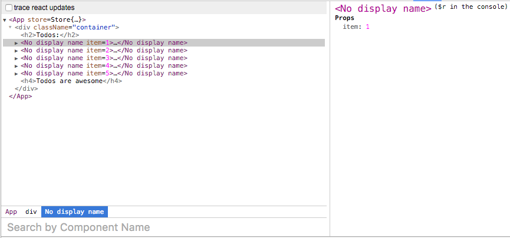
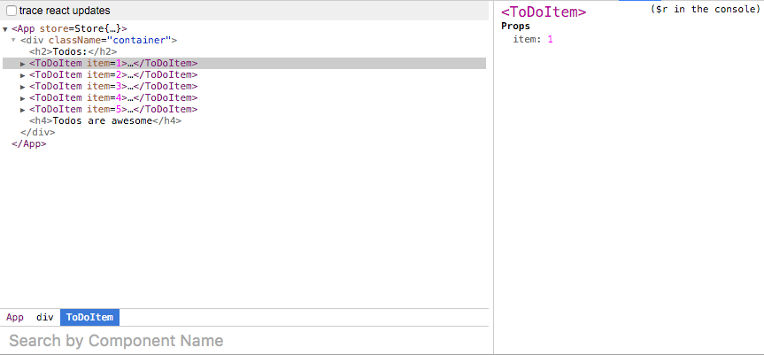

# 使用无状态组件的热加载(Hot Module Reloading)

当刚接触 MobX(和普通的 React) 时有一个挑战就是理解为什么热加载(HMR)有时会失败。当热加载起初工作时，它看起来像魔术一般(确实也是)，但是有一个关于 HMR 和 React 的粗糙边缘，那就是无状态组件。因为无状态组件不会显示地把自己定义为 React 组件，对于它们 HMR 不知道该怎么做，所以你经常会在控制台看到这样的警告:

```
[HMR] The following modules couldn't be hot updated: (Full reload needed)
This is usually because the modules which have changed (and their parents) do not know how to hot reload themselves. See http://webpack.github.io/docs/hot-module-replacement-with-webpack.html for more details.
[HMR]  - ./src/ToDoItem.jsx
```

当你开始使用 MobX 时，这一点尤其明显，因为 observables 使得创建大量的无状态组件变得非常容易。这里有一些小贴士，是关于如何构建无状态组件的同时还能享受HMR带来的便利:

## 使用函数声明来替代箭头函数

函数声明和箭头函数所做的事完全相同，但实际上它们具有在 React 开发者工具中具有名称的关键优势。

举例来说，有一些使用箭头函数构建的无状态组件:

```javascript
const ToDoItem = observer(props => <div>{props.item}</div>);

export default ToDoItem;

```

And here's how that will appear in the React DevTools:



On the other hand, using a function declaration will allow you to build the same stateless component AND see it in the DevTools:

```javascript
function ToDoItem(props) {
  return <div>{props.item}</div>
}

export default observer(ToDoItem);

```

And now the component shows up correctly in the DevTools:



## Make sure your top-level component is a stateful observer

By "stateful observer", all I really mean is a component created with `React.Component` or `React.createClass` and which uses the `@observer` decorator, like so:

```javascript
import { observer } from 'mobx-react';

@observer
class App extends React.Component {
  constructor(props) {
    super(props);
    this.store = props.store;
  }

  render() {
    return (
      <div className="container">
        <h2>Todos:</h2>
        {
          this.store.todos.map((t, idx) => <ToDoItem key={idx} item={t}/>)
        }
      </div>
    );
  }
}

```

In this case, `ToDoItem` is stateless, but will still work with HMR because the root-level of the UI tree is a stateful observer. As a result, whenever we change **any** stateless component, it will be hot-reloaded because the observers will trigger computations in the root-level component as well. And since the root-level component is a good old-fashioned React component, it'll trigger the HMR for all of its children and voila! All the magic of stateless components, observables, and hot module reloading working together beautifully.
